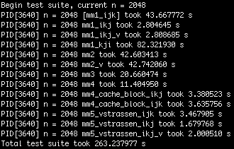
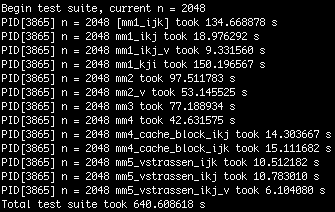

## Description

12 different implementations of matrix multiplication

#### Basic versions

| Function Name       | Description                                                  |
| :------------------ | :----------------------------------------------------------- |
| mm1_ijk             | simple ijk version                                           |
| mm1_ikj             | simple ikj version                                           |
| mm1_kji             | simple kji version                                           |
| mm1_ikj_v           | vectorized version of mm1_ikj, unroll loop by length 8       |
| mm2                 | aviod 1 load and 1 store in inner iteration                  |
| mm2_v               | vectorized mm2, unroll loop by length 8                      |
| mm4                 | 2 by 2 mini matrix multiplications in registers, n must be multiple of 2 |
| mm4_cache_block_ijk | Cache friendly block multiplication, n must be multiple of BSIZE (32) |
| mm4_cache_block_ikj | ikj version of mm4_cache_block, n must be multiple of BSIZE (32) |

#### V Strassen Algorithm

| Function Name       | Description                      |
| :------------------ | :------------------------------- |
| v_strassen          | V Strassen Core                  |
| mm5_vstrassen_ijk   | ijk version                      |
| mm5_vstrassen_ikj   | Ikj version                      |
| mm5_vstrassen_ikj_v | partially vectorized Ikj version |

#### V Strassen Core

```c
/*
 [Illustration]

        Draft Zone              NxN Matrix A              NxN Matrix B              NxN Matrix C
      nmx := next mx
  ---------------------     ---------------------     ---------------------     ---------------------
  |         |         |     |         |         |     |         |         |     |         |         |
  |    mx   |   nmx   |     |   a00   |   a01   |     |   b00   |   b01   |     |   c00   |   c01   |
  |         |         |     |         |         |     |         |         |     |         |         |
  ---------------------     ---------------------  X  ---------------------  =  ---------------------
  |         |         |     |         |         |     |         |         |     |         |         |
  |  azone  |  bzone  |     |   a10   |   a11   |     |   b10   |   b11   |     |   c10   |   c11   |
  |         |         |     |         |         |     |         |         |     |         |         |
  ---------------------     ---------------------     ---------------------     ---------------------

  m1 = (a00+a11)*(b00+b11)                            c00 = m1 + m4 - m5 + m7
  m2 = (a10+a11)*b00                                  c01 = m3 + m5
  m3 = a00*(b01-b11)                                  c10 = m2 + m4
  m4 = a11*(b10-b00)                                  c11 = m1 + m3 - m2 + m6
  m5 = (a00+a01)*b11
  m6 = (a10-a00)*(b00+b01)
  m7 = (a01-a11)*(b10+b11)

[Params]

 Inputs:
  a00 := pointer of the element at matrix A's UP-LEFT corner
  b00 := pointer of the element at matrix B's UP-LEFT corner
  n   := the size of current square window of operation
  nn  := the size of original matrix before first recursion, this value shouldn't be changed during recursion
  mx  := the allocated draft zone provided by caller, should be initialized to 0 before first recursion
         length = nn * nn, size = sizeof(double) * nn * nn
 Outputs:
  c00 := pointer of the element at result matrix C's UP-LEFT corner
*/
```


## Get Started

#### Build the source

```shell
git clone https://github.com/YanzheL/matmul_demo.git
cd matmul_demo
mkdir cmake-build-debug && cd cmake-build-debug
cmake ..
make
```

#### Run

```shell
./matmul_demo
```

You can modify main.c to change test cases. (e.g. n range)


## Test Results

#### Platform Info

| OS           | CPU                                                          | Memory            | Compiler  |
| ------------ | ------------------------------------------------------------ | ----------------- | --------- |
| Ubuntu 18.04 | Intel Core i7-8700, 6 Core, 4.6 GHz, L1=384 KiB, L2=1.5 MiB, L3=15 MiB | DDR4 16GB 3200MHz | Clang-8.0 |

#### Test cases

Use mm1_ijk version as standard result to test other implementation's correctness. If the multiplication result is incorrect, it will output an ERROR message and Mean Square Error (MSE) of the corresponding mm function.

More benchmark results are located at `benchmark` directory

1. With compiler optimization flag -O3, running each test case one-by-one (multithread disabled)

   

2. Without compiler optimization flag, running each test case one-by-one (multithread disabled)

   
